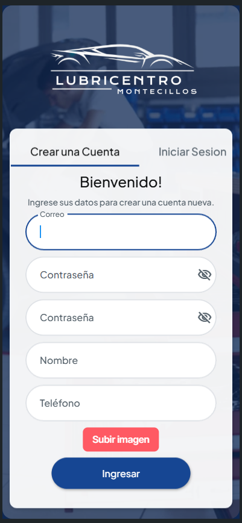
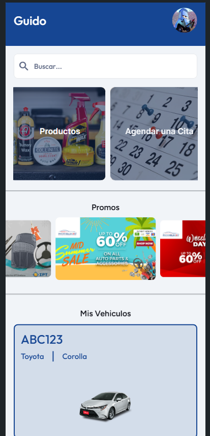
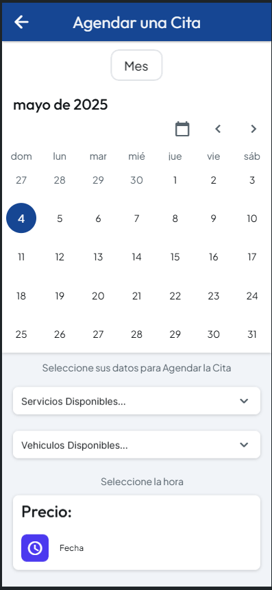
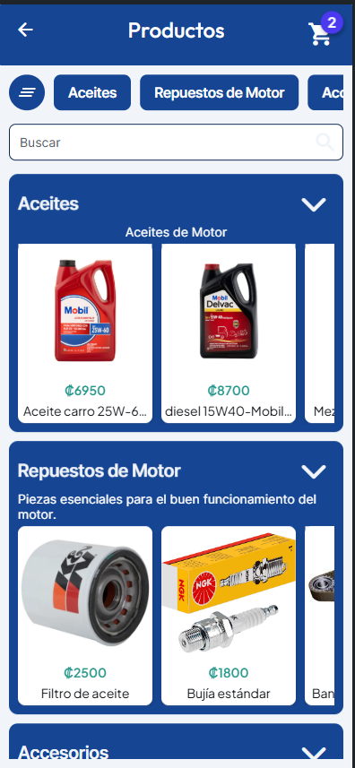
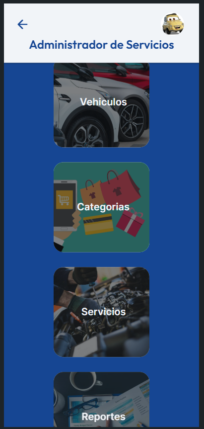
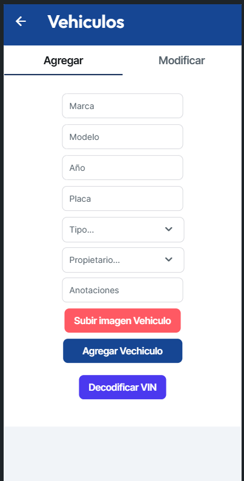
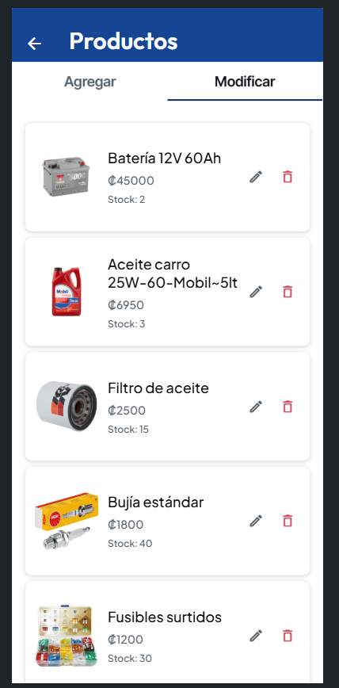

# 🚗🔧 Lubricentro Montecillos

**Lubricentro Montecillos** es una plataforma web y móvil para un taller automotriz que permite a los usuarios realizar citas para servicios de mantenimiento y comprar productos. Además, los administradores del taller pueden gestionar el historial de vehículos atendidos, el inventario de productos y los servicios ofrecidos. La aplicación está diseñada para funcionar con roles diferenciados, lo que permite tener pantallas y funcionalidades específicas para usuarios y administradores.

---

## ✨ Funcionalidades Principales

- **Registro y autenticación de usuarios**: Los usuarios pueden crear cuentas y acceder a sus perfiles.
- **Sistema de roles**: Los usuarios y administradores tienen accesos diferenciados. Los usuarios pueden hacer citas y compras, mientras que los administradores pueden gestionar el historial de vehículos y productos.
- **Citas para servicios automotrices**: Los usuarios pueden agendar servicios como cambio de llantas, filtros, aceites, etc.
- **Carrito de compras**: Los usuarios pueden comprar productos relacionados con el mantenimiento de sus vehículos.
- **Estado en tiempo real**: Los usuarios pueden ver el estado de sus citas en tiempo real, lo que les permite saber cuándo serán atendidos.
- **Historial de servicios**: Los administradores pueden ver el historial de vehículos atendidos, productos vendidos y los servicios realizados.
- **Gestión de productos y servicios**: Los administradores pueden agregar, editar o eliminar productos y servicios disponibles en el taller.

---

## 📸 Vista previa del proyecto

### Login y Pantalla principal (Usuario)



### Agendar cita para servicio


### Carrito de compras


### Panel de administración




---

## 🛠️ Tecnologías utilizadas

- **FlutterFlow**: Herramienta utilizada para el diseño y desarrollo de la aplicación.
- **Firestore** (Base de datos NoSQL): Se utiliza para almacenar la información de usuarios, productos, citas, y más.
- **Firebase Authentication**: Para la autenticación y registro de usuarios.
- **Firebase Storage**: Para almacenar imágenes y otros archivos multimedia.

---

## ⚡ Cómo ejecutar el proyecto

```bash
# Clona el repositorio
git clone https://github.com/tu-usuario/Lubricentro.git
cd Lubricentro

# Abre el proyecto en FlutterFlow para hacer ajustes y configuraciones.
# Asegúrate de tener las credenciales de Firebase configuradas.


## Getting Started

FlutterFlow projects are built to run on the Flutter _stable_ release.
